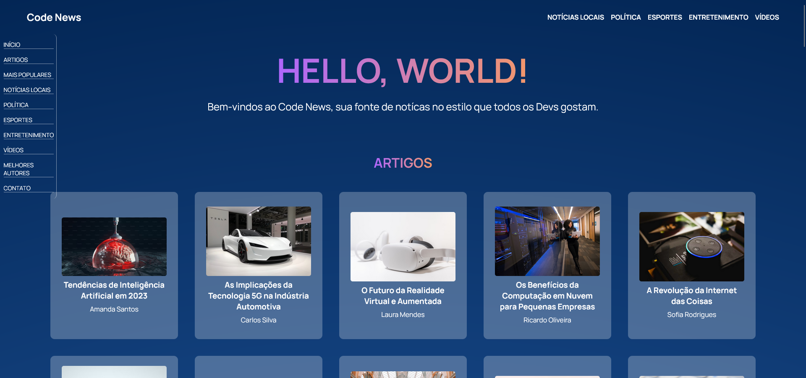

# Projeto Code News

Um site de notícias voltados para os desenvolvedores, com diversos assuntos, mas tudo relacionado a tecnologia!

Projeto de finalização do módulo de HTML do Bootcamp Fullstack + Cloud da SoulCode. 

<br>

## Índice
- <a href='#funcionalidades'>Funcionalidades do Projeto</a>
- <a href='#demonstracao'>Demonstração</a>
- <a href='#rodar'>Como Rodar este Projeto? </a>
- <a href='#tecnologias-utilizadas'>Tecnologias Utilizadas </a>
- <a href='#autor'>Autor</a>
- <a href='#passos'>Próximos Passos</a>

<br>

## 💻 Funcionalidades do Projeto
✅ Acesso aos artigos gerados por Inteligência Artificial (IA) através de ancoragem das páginas. <br>
✅ Barra de navegação para acessar as diferentes seções da página. <br>
✅ Listas não ordenadas e ordenadas das diferentes classifições. <br>
✅ Menu lateral para navegação em toda a página. <br>
✅ Página de contato para envio de mensagens. <br>
<br>

## 🤳🏼 Demonstração
[Live URL](https://projeto-html-ruddy.vercel.app/)

<br>

## 📲 Como Rodar este Projeto?
Para rodar este projeto é necessário:
- Acesso a um editor de código, preferencialmente o VS Code.
- Acesso a um prompt de comando ou terminal similar.

Execute no terminal o seguinte código:
```bash
    # Clone este repositório
    $ git clone linkrepo

    # Acesse a pasta do projeto no seu terminal
    $ cd projeto-html

    # Abra o VS Code
    $ code .
```
<br>

## 🛠 Tecnologias Utilizadas
1. [HTML](https://developer.mozilla.org/pt-BR/docs/Web/HTML)
2. [CSS](https://developer.mozilla.org/pt-BR/docs/Web/CSS)
3. [JavaScript](https://developer.mozilla.org/pt-BR/docs/Web/JavaScript)

<br>

## 🙋🏾‍♂️Autor


<br>

- [LinkedIn: Lucas Leite](https://www.linkedin.com/in/lucas-g-leite/) <br>
- [GitHub: luc4sleite](https://github.com/luc4sleite)

<br>

## 🚶🏾‍♂️ Próximos Passos
- [ ] Aprimorar o CSS da página.
- [ ] Colocar mais funcionalidades da página através do JavaScript.
- [ ] Utilizar JSON para elaboração dos artigos.
